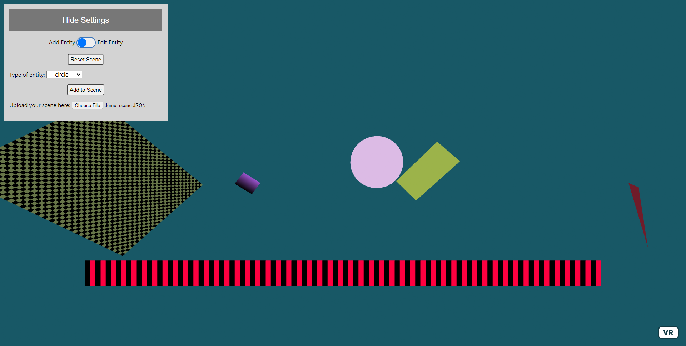
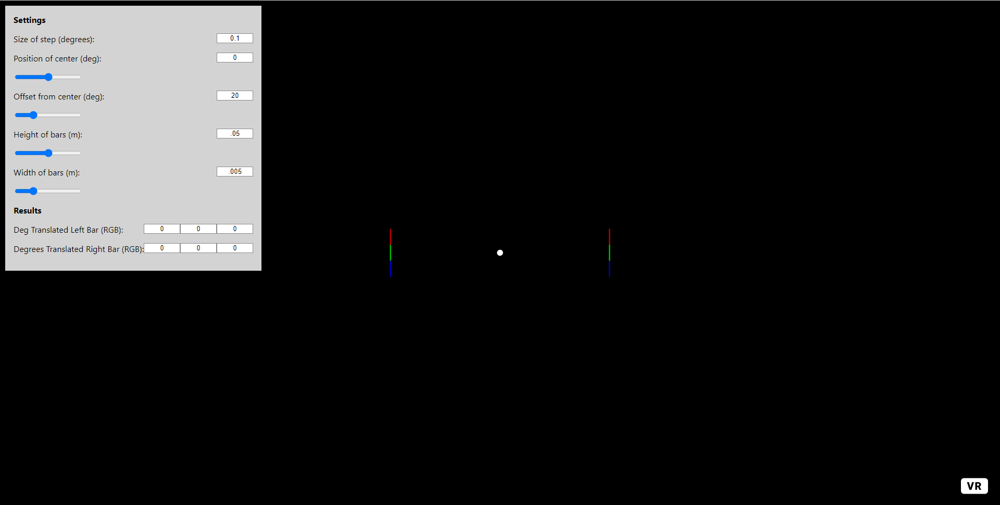

# WebXR Tools

> Fork note: this fork adds a [gesture bridge](./bridge) so the Custom
> Pattern Creator can be driven by an external gesture source (e.g. a Meta
> Neural Band companion app) over WebSocket, in addition to the existing
> keyboard/VR-controller input. See [`bridge/README.md`](./bridge/README.md).

This page contains a few tools and concepts for the use of WebVR in regulatory science.

The two notable tools are the [Custom Pattern Creator tool](./Custom) and the [TCA Test tool](./TCA)

The other two tools provided were proof of concepts and can be used as models for anyone wishing to do something similar.
 

## Custom Pattern Creator

## TCA Test

